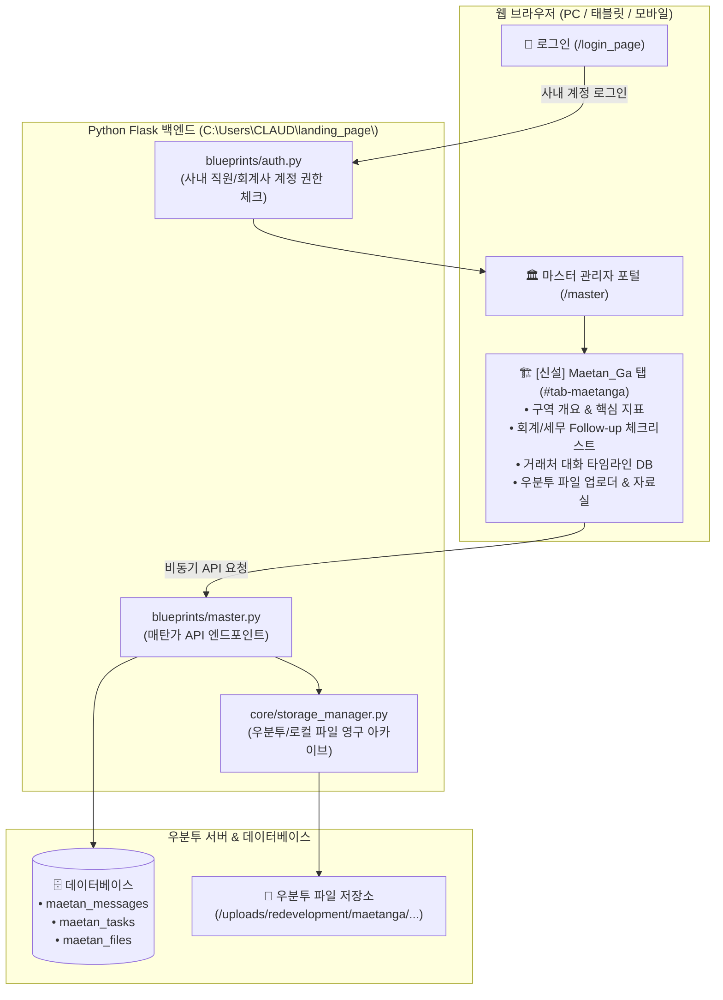

# 🏗️ HEYAN 마스터 포털: Maetan_Ga 탭 신설 및 사내 공유·우분투 아카이빙 구현 계획서

> **프로젝트 위치**: `C:\Users\CLAUD\landing_page\`  
> **기반 기술**: Python Flask (3.0.0), Jinja2 HTML/CSS/JS, 우분투 스토리지, SQLite/Supabase DB  
> **문서 목적**: 매탄가구역 재개발 회계·세무 관리 탭 추가, 사내 구성원 로그인 공유, 대화 DB화 및 우분투 파일 영구 아카이빙 구현 가이드  

---

## 1. 전체 아키텍처 및 데이터 흐름



---

## 2. 세부 개발 단계별 구현 계획

### [Step 1] `templates/master.html`에 `Maetan_Ga` 탭 UI 신설

#### 1. 좌측 사이드바 메뉴 추가
```html
<li class="master-menu-item" data-menu="maetanga" data-tab="tab-maetanga">
    <a href="#tab-maetanga">
        <svg class="master-menu-icon" viewBox="0 0 24 24">
            <path d="M12 3L2 12h3v8h14v-8h3L12 3zm0 2.84L18 11v7h-3v-4H9v4H6v-7l6-5.16z"/>
        </svg>
        <span>매탄가구역 재개발</span>
    </a>
</li>
```

#### 2. 메인 컨텐츠 영역 (`#tab-maetanga`) 4대 섹션 구성
1. **📊 구역 개요 & 실시간 지표 카드**:
   * 사업 단계: `조합설립추진위원회 승인 (2026.04.28)`
   * 추진위원장: `손성균` / 대표지번: `매탄동 130-50번지 일원`
   * 예상 세대수: `약 900 ~ 1,200세대` / 개략 총사업비: `약 5,000억 ~ 7,000억 원`
   * 장부 잔액: `17,218,725원` (2026.08 기준)
2. **✅ 회계·세무 Follow-up 인터랙티브 체크리스트**:
   * `[진행]` (주)진솔씨앤씨 차입금 금전소비대차계약서 및 인정이자 세무 정비
   * `[진행]` 손성균 위원장/박영철 위원 활동비 원천징수(근로/사업/기타) 소급 신고
   * `[진행]` 3만원 초과 지출 적격증빙(세금계산서/신용카드) 전수 매칭
   * `[대기]` 추진위 → 조합 인계 시점 도정법 제125조 제1차 법정 회계감사 수검 준비
   * `[대기]` 도정법 제124조 분기별 정보공개용 결산서 표준화
3. **💬 거래처 대화 & 커뮤니케이션 타임라인 피드**:
   * 통화/카톡/미팅 내용 입력 폼 (`작성자`, `상대방`, `구분: 유선/대면/카톡`, `내용`, `중요도 태그`)
   * 날짜별 타임라인 카드 표출, 키워드 검색, 중요 메모 고정 기능
4. **📂 우분투 서버 파일 드래그앤드롭 업로더 & 카테고리 자료실**:
   * 카테고리 분류: `01_기본규정_공식문서`, `02_회계장부_증빙`, `03_총회_회의자료`, `04_자문_감사보고서`
   * 드래그앤드롭 파일 업로드 및 원클릭 다운로드/삭제

---

### [Step 2] 사내 로그인 시 페이지 공유 및 접근 권한 설정 (`blueprints/auth.py`)

* **목표**: 마스터 관리자(`MASTER_EMAIL`) 외에 회사 임직원/회계사 계정 로그인 시 `Maetan_Ga` 탭을 공유하여 조회 및 입력 가능하도록 설정.
* **구현 로직**:
  * 사내 계정 판별 로직 추가 (사내 도메인 `@heyan.co.kr` 또는 사내 승인 유저 테이블).
  * 일반 기업 고객은 본인 회사 페이지만 접근하고, 사내 직원은 마스터 포털 및 `Maetan_Ga` 탭 접근 허용.

---

### [Step 3] 백엔드 API 및 데이터베이스 연동 (`blueprints/master.py`)

#### 1. 데이터베이스 테이블 구조
* `maetan_messages`:
  * `id`, `date`, `author`, `contact_person`, `channel`, `content`, `tags`, `created_at`
* `maetan_tasks`:
  * `id`, `category`, `task_name`, `due_date`, `is_completed`, `updated_at`
* `maetan_files`:
  * `id`, `category`, `original_filename`, `stored_filename`, `file_size`, `uploaded_by`, `created_at`

#### 2. 주요 API 엔드포인트
* `GET /master/api/maetanga/data`: 대시보드 전체 데이터 (지표, 체크리스트, 대화목록, 파일목록) 일괄 조회
* `POST /master/api/maetanga/messages`: 새 대화 내역 저장
* `POST /master/api/maetanga/tasks/toggle`: 체크리스트 상태(완료/미완료) 업데이트
* `POST /master/api/maetanga/upload`: 파일 업로드 및 우분투 스토리지 저장
* `GET /master/api/maetanga/download/<category>/<filename>`: 파일 다운로드

---

### [Step 4] 우분투 서버 파일 영구 아카이빙 (`core/storage_manager.py`)

* **저장 경로 구조**:
  ```text
  /uploads/redevelopment/maetanga/
  ├── 01_기본규정_공식문서/   (선거관리규정.pdf, 업무규정.pdf 등)
  ├── 02_회계장부_증빙/       (회계지출현황.pdf, 세금계산서, 영수증)
  ├── 03_총회_회의자료/       (주민총회_1차_초청장.jpg, 총회책자)
  ├── 04_자문_감사보고서/     (비례율 검토서, 감사보고서)
  └── 05_일반첨부/
  ```
* 우분투 서버 배포 환경(Nginx + Gunicorn) 및 로컬 환경 모두에서 경로가 자동으로 감지되어 파일이 안전하게 보관되도록 구현.

---

## 3. 수정 및 신규 대상 파일 목록

| 번호 | 구분 | 파일 경로 | 역할 |
| :---: | :---: | :--- | :--- |
| 1 | **[MODIFY]** | `templates/master.html` | 사이드바 메뉴 및 `#tab-maetanga` UI (지표, 체크리스트, 대화피드, 파일함) 추가 |
| 2 | **[MODIFY]** | `blueprints/master.py` | 매탄가 전용 데이터 조회, 대화 저장, 파일 업로드 API 엔드포인트 추가 |
| 3 | **[MODIFY]** | `blueprints/auth.py` | 사내 계정 로그인 시 마스터/매탄가 탭 접근 권한 허용 |
| 4 | **[MODIFY]** | `core/storage_manager.py` | 정비사업 전용 디렉터리 자동 생성 및 파일 저장/다운로드 지원 |
| 5 | **[NEW]** | `static/js/maetanga.js` | 매탄가 탭 전용 비동기 통신(대화 저장, 체크리스트 토글, 파일 업로드) JS |

---

## 4. 실행 및 테스트 절차

1. **로그인 권한 검증**: 사내 계정으로 로그인 후 좌측 사이드바의 `매탄가구역 재개발` 메뉴 클릭 시 대시보드가 정상 표시되는지 확인.
2. **대화 내역 입력 테스트**: 통화/카톡 메모를 입력하고 `[저장]` 버튼을 누르면 타임라인에 즉시 반영되고 새로고침 후에도 유지되는지 확인.
3. **체크리스트 토글 테스트**: 세무 일정 체크박스를 클릭하여 상태가 DB에 즉시 업데이트되는지 확인.
4. **파일 업로드 & 우분투 저장 테스트**: 기존 PDF 규정안 및 초청장 사진을 드래그앤드롭으로 업로드하고, 서버의 `/uploads/redevelopment/maetanga/` 폴더에 정상 보관되는지 검증.