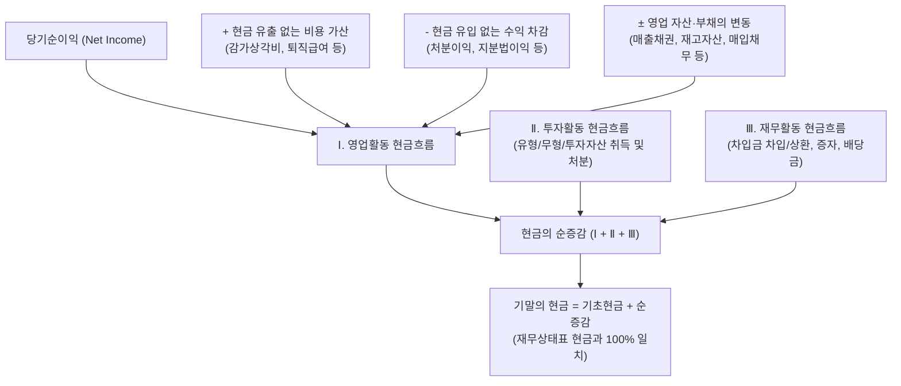

# 📊 HEYAN 재무제표 작성 및 표시 지침서 (Financial Statement Presentation Guidelines)
> **K-GAAP / K-IFRS 표준 회계기준 및 5대 재무제표 상호 대사 무결성 보장을 위한 종합 실무 지침**
> **버전**: v1.0.0 (2026.09.26) | **적용 대상**: HEYAN 회계 데이터 파이프라인, AI 감사 엔진, Lakehouse 5대 재무제표

---

## Ⅰ. 총칙 및 기본 원칙 (General Principles)

### 1. 목적 (Purpose)
본 지침은 HEYAN 시스템 내에서 회계 원장(시산표, 분개장, 계정별원장, 보조부) 및 정규화 데이터셋(Normalized Lakehouse)을 기반으로 **5대 재무제표(재무상태표, 포괄손익계산서, 현금흐름표, 자본변동표, 주석)**를 생성, 표시, 검증할 때 준수해야 하는 회계학적 원칙과 기술적 표준을 규정함을 목적으로 한다.

### 2. 준용 회계기준 (Applicable Standards)
* **일반기업회계기준(K-GAAP)** 제2장 「재무제표의 작성과 표시」, 제3장 「재무제표의 기본원칙」
* **한국채택국제회계기준(K-IFRS)** 제1001호 「재무제표 표시」, 제1007호 「현금흐름표」
* **금융감독원 전자공시시스템(DART)** 표준 재무제표 작성 규칙 및 계정과목 표준체계

### 3. 기본 작성 대원칙 (Core Principles)
1. **비교식 표시의 원칙**:
   모든 재무제표는 당기(Current Period)와 전기(Prior Period)의 수치를 병렬 비교 표시한다.
2. **총액 표시의 원칙(Gross Reporting)**:
   자산, 부채, 자본, 수익, 비용은 원칙적으로 상계하여 순액으로 표시하지 않고 총액으로 표시한다. 단, 자산의 차감적 평가계정(대손충당금, 감가상각누계액 등)은 해당 본계정에서 차감하는 형식으로 총액과 순액을 함께 표시한다.
3. **상호 교차 대사 무결성(Cross-Statement Integrity)**:
   * 손익계산서의 **당기순이익** = 자본변동표의 **당기순이익** = 현금흐름표의 **영업활동 시작 당기순이익**
   * 재무상태표의 **기말 자본총계 및 이익잉여금** = 자본변동표의 **기말 자본총계 및 이익잉여금** ($\Delta = 0$)
   * 재무상태표의 **현금및현금성자산** = 현금흐름표의 **기말의 현금** ($\Delta = 0$)
4. **결정론적 산출(Deterministic Computation)**:
   LLM의 추론이나 환각에 의존하지 않고, 100% 검증된 파이썬 알고리즘(`core/financial_pipeline.py`)을 통해 수학적·회계적으로 산출한다.

---

## Ⅱ. 재무상태표 (Statement of Financial Position - B/S) 작성 지침

### 1. 컬럼 구성 (7개 컬럼)
```text
[ 계정과목 | 당기총액 | 당기순액 | 전기총액 | 전기순액 | 증감액 | 증감율 ]
```

### 2. 계정 표시 및 차감 항목 처리 지침
1. **차감 계정이 존재하는 본계정 (Gross & Deduction Items)**:
   * **매출채권/미수금**: 외상매출금(총액)에서 대손충당금(차감)을 차감하여 장부가액(순액)을 산출한다.
   * **유형자산**: 취득원가(총액)에서 감가상각누계액(차감) 및 정부보조금(차감)을 차감하여 장부가액(순액)을 산출한다.
   * **무형자산**: 취득원가(총액)에서 상각누계액(차감)을 차감하여 순액을 산출한다.
   * **표시 위치**:
     - 본계정(총액) 및 차감계정(차감액) ➡️ **`당기총액` / `전기총액`** 열에 표시
     - 차감 후 최종 장부가액 ➡️ **`당기순액` / `전기순액`** 열에 표시
2. **차감 계정이 없는 독립 계정 (Net-Only Items)**:
   * 현금및현금성자산, 단기예금, 선급금, 재고자산, 매입채무, 차입금 등 차감 항목이 없는 일반 계정은 **`당기순액` / `전기순액`** 열에만 표시하고 총액 열은 비워둔다.
3. **충당부채 및 음수(-) 표기 오류 방지**:
   * **퇴직급여충당부채**, **복구충당부채** 등은 자산의 차감계정이 아닌 **비유동부채** 항목이므로, 반드시 **양수(+)**로 대변 잔액을 표시해야 한다. (시산표 차변/대변 위치 반전 오류 방지)
4. **대차평형 검증 공식**:
   $$\text{자산총계} = \text{부채총계} + \text{자본총계}$$
   $$\text{차액}(\Delta) = |\text{자산총계} - (\text{부채총계} + \text{자본총계})| = 0$$

---

## Ⅲ. 포괄손익계산서 (Statement of Comprehensive Income - I/S) 작성 지침

### 1. 컬럼 구성 (7개 컬럼)
```text
[ 계정과목 | 당기세부 | 당기금액 | 전기세부 | 전기금액 | 증감액 | 증감율 ]
```

### 2. 2-Tier 계층 표시 구조 지침
1. **대분류 및 주요 소계 (금액 열 표시)**:
   * `Ⅰ. 매출액`
   * `Ⅱ. 매출원가`
   * `Ⅲ. 매출총이익` ($Ⅰ - Ⅱ$)
   * `Ⅳ. 판매비와관리비`
   * `Ⅴ. 영업이익` ($Ⅲ - Ⅳ$)
   * `Ⅵ. 영업외수익`
   * `Ⅶ. 영업외비용`
   * `Ⅷ. 법인세비용차감전순이익` ($Ⅴ + Ⅵ - Ⅶ$)
   * `Ⅸ. 법인세비용`
   * `Ⅹ. 당기순이익` ($Ⅷ - Ⅸ$)
   * 위 소계 및 대분류는 **`당기금액` / `전기금액`** 열에 표시한다.
2. **세부 명세 항목 (세부 열 표시)**:
   * **매출원가 세부내역**: 기초재고자산, 당기제품제조원가(또는 당기상품매입액), 타계정으로의대체액, 기말재고자산
   * **판매비와관리비 세부내역**: 급여, 퇴직급여, 복리후생비, 임차료, 감가상각비, 세금과공과, 광고선전비 등
   * **영업외손익 세부내역**: 이자수익, 이자비용, 외환차손익, 외화환산손익, 유형자산처분손익 등
   * 위 세부 계정과목들은 **`당기세부` / `전기세부`** 열에 표시하여 가독성을 극대화한다.

---

## Ⅳ. 현금흐름표 (Statement of Cash Flows - C/F) 작성 지침 (간접법)

### 1. 컬럼 구성 (5개 컬럼)
```text
[ 계정과목 | 당기세부 | 당기소계 | 전기세부 | 전기소계 ]
```

### 2. 간접법(Indirect Method) 3대 활동 분류 및 세부 산출 원칙



1. **Ⅰ. 영업활동으로 인한 현금흐름 (Operating Activities)**:
   * **1. 당기순이익**: 손익계산서의 최종 당기순이익에서 출발
   * **2. 현금유출이 없는 비용 등의 가산**:
     - 감가상각비, 무형자산상각비, 퇴직급여(전입액), 대손상각비, 유형자산처분손실, 사채할인발행차금상각, 외화환산손실 등
   * **3. 현금유입이 없는 수익 등의 차감**:
     - 유형자산처분이익, 외화환산이익, 지분법이익, 대손충당금환입 등
   * **4. 영업활동으로 인한 자산·부채의 변동**:
     - 매출채권의 감소(증가), 재고자산의 감소(증가), 선급금/선급비용의 증감
     - 매입채무의 증가(감소), 미지급금/미지급비용의 증감, 예수금의 증감, 퇴직금의 실제 지급액(부채 감소)
2. **Ⅱ. 투자활동으로 인한 현금흐름 (Investing Activities)**:
   * 재무상태표의 **유형자산, 무형자산, 투자자산, 장·단기대여금**의 변동을 추적
   * 투자자산/유형자산의 처분(유입 `+`), 투자자산/유형자산의 취득(유출 `-`)
   * 투자활동 관련 손익(감가상각비, 처분손익 등)은 영업활동에서 가감 조정하고 투자활동 본문에 현금 순변동으로 집계
3. **Ⅲ. 재무활동으로 인한 현금흐름 (Financing Activities)**:
   * 재무상태표의 **단기차입금, 장기차입금, 유동성장기부채, 사채, 자본금, 자본잉여금** 변동 추적
   * 단기/장기차입금의 차입(유입 `+`), 단기/장기차입금의 상환(유출 `-`)
   * 유상증자(유입 `+`), 유상감자(유출 `-`), **배당금의 지급(유출 `-`)**
4. **기말 현금잔액 일치성 검증 (Reconciliation)**:
   $$\text{현금의 순증감} = \text{영업활동} + \text{투자활동} + \text{재무활동}$$
   $$\text{기말의 현금} = \text{기초의 현금} + \text{현금의 순증감} = \text{재무상태표 당기말 현금및현금성자산}$$

---

## Ⅴ. 자본변동표 (Statement of Changes in Equity - C/E) 6단계 작성 지침

### 1. 컬럼 매트릭스 구성 (7개 컬럼)
```text
[ 구분 | 자본금 | 자본잉여금 | 자본조정 | 기타포괄손익누계액 | 이익잉여금 | 자본총계 ]
```

### 2. 6단계 표준 시계열 작성 프로세스

| 단계 | 구분 항목 | 세부 산출 및 데이터 매핑 기준 |
|:---:|:---|:---|
| **Step 1** | **Ⅰ. 전기초 (Prior Beginning)** | 전기 비교표시 기초재무상태표(예: 2024.01.01)의 자본 각 항목 금액 인입 |
| **Step 2** | **Ⅱ. 전기 자본의 변동** | 1) 전기 당기순이익 (손익계산서 전기순이익 반영)<br>2) 전기 배당금 지급 및 이익처분<br>3) 전기 유상증자/감자 등 |
| **Step 3** | **Ⅲ. 전기말 합계 (Prior Ending)** | 전기초 + 전기변동액 항목별 합계 산출<br>👉 **재무상태표 전기말(2024.12.31) 자본 각 항목과 100% 일치 검증** |
| **Step 4** | **Ⅳ. 당기초 이월 (Current Beginning)** | 전기말 합계 수치를 당기초(2025.01.01)로 100% 동일 이월 |
| **Step 5** | **Ⅴ. 당기 자본의 변동** | 1) 당기 당기순이익 (손익계산서 당기순이익 반영)<br>2) 당기 배당금 지급 및 이익처분 (기초잉여금 + 당기순익 - 기말잉여금)<br>3) 당기 유상증자/감자, 자본조정 변동 등 |
| **Step 6** | **Ⅵ. 당기말 합계 (Current Ending)** | 당기초 + 당기변동액 항목별 합계 산출<br>👉 **재무상태표 당기말(2025.12.31) 자본 각 항목과 100% 일치 검증** |

### 3. 이익처분액 및 배당금 역산 공식
기중 잉여금처분계산서 데이터가 미비한 경우, 재무상태표와 손익계산서의 수치를 통해 다음과 같이 회계적 이익처분액(배당금 등)을 결정론적으로 도출한다:
$$\text{당기 이익처분액} = \text{전기말(당기초) 이익잉여금} + \text{당기순이익} - \text{당기말 이익잉여금}$$
* 산출된 이익처분액은 자본변동표의 `배당금 지급 및 이익처분` 행에 음수(`-`)로 반영되어 전기말에서 당기말로 이어지는 이익잉여금 변동의 회계적 연속성을 보장한다.

---

## Ⅵ. 5대 재무제표 상호 교차 검증 매트릭스 (Reconciliation Matrix)

시스템은 재무제표를 렌더링하기 전 백엔드(`financial_pipeline.py`) 및 프론트엔드에서 다음 5대 대사 검증을 자동으로 수행하며, 불일치 발생 시 즉시 경고 로그를 기록한다:

```text
┌─────────────────────────┐
│     포괄손익계산서      │
│  당기순이익: 722,056,141 │
└────────────┬────────────┘
             │ (1) 100% 일치
             ▼
┌─────────────────────────┐         (3) 기말현금 일치         ┌─────────────────────────┐
│       현금흐름표        │ ───────────────────────────────▶ │       재무상태표        │
│  영업시작: 722,056,141  │                                 │  현금: 1,639,498,053    │
│  기말현금: 1,639,498,053│                                 │  자본총계: 2,994,438,467│
└─────────────────────────┘                                 └────────────▲────────────┘
             │                                                           │
             │ (2) 당기순익 반영                                         │ (4) 기말자본 100% 일치
             ▼                                                           │
┌────────────────────────────────────────────────────────────────────────┴┐
│                              자본변동표                                 │
│  당기순이익: 722,056,141 ──▶ 당기말 이익잉여금: 2,594,438,467           │
│                            당기말 자본총계:   2,994,438,467            │
└─────────────────────────────────────────────────────────────────────────┘
```

| 검증 항목 | 검증 대상 A | 검증 대상 B | 허용 오차 | 결과 판정 |
|:---|:---|:---|:---:|:---:|
| **1. 대차평형 (Balance Check)** | 재무상태표 자산총계 | 재무상태표 (부채총계 + 자본총계) | 0 원 | **PASSED** |
| **2. 당기순손익 연동** | 손익계산서 당기순이익 | 자본변동표 당기순이익 행 | 0 원 | **PASSED** |
| **3. 현금흐름 출발점 연동** | 손익계산서 당기순이익 | 현금흐름표 영업활동 당기순이익 | 0 원 | **PASSED** |
| **4. 기말 현금 대사** | 현금흐름표 기말의 현금 | 재무상태표 현금및현금성자산 | 0 원 | **PASSED** |
| **5. 전기말 자본 대사** | 자본변동표 Ⅲ. 전기말 합계 | 재무상태표 전기말 자본총계/잉여금 | 0 원 | **PASSED** |
| **6. 당기말 자본 대사** | 자본변동표 Ⅵ. 당기말 합계 | 재무상태표 당기말 자본총계/잉여금 | 0 원 | **PASSED** |

---

## Ⅶ. 향후 고도화 로드맵 (Advanced Roadmap)

1. **K-GAAP 주석(Notes 1~30) 자동 바인딩 고도화**:
   * 본 5대 재무제표 지침에 기반하여 유형자산 변동명세(주석 6), 차입금 상환스케줄(주석 8), 특수관계자 거래(주석 13), 잉여금처분계산서(주석 10)의 수치 완전 일치 자동화
2. **다기간(Multi-Period: 3개년/5개년) 연속 롤포워드 엔진**:
   * 2개년(당기/전기)을 넘어 3~5개년 연속 자본변동 및 현금흐름 추적 모듈 확장
3. **K-IFRS / 연결재무제표(Consolidated FS) 호환 모듈 구축**:
   * 지배기업지분/비지배지분 분리 표시 및 내부거래 제거 반영 파이프라인 연계
